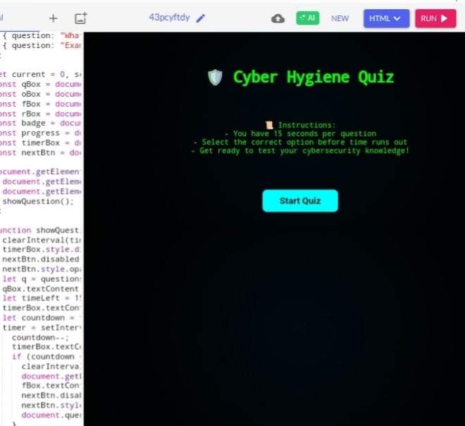
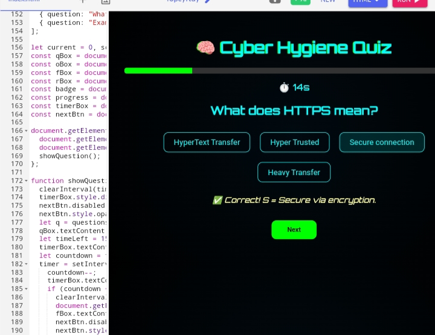
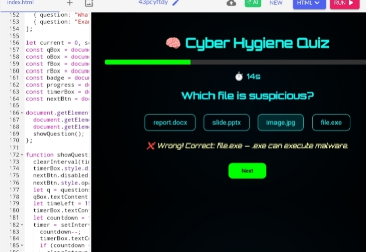
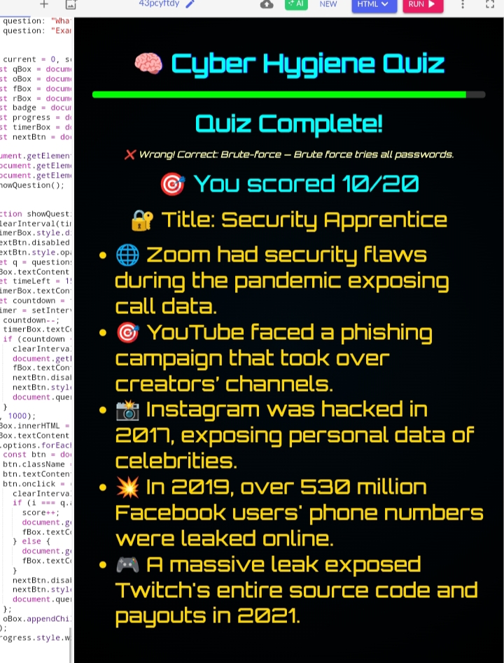

# 🛡️ Cyber Hygiene Quiz

An interactive and visually engaging quiz that tests your cybersecurity awareness. Built with HTML, CSS, and JavaScript, it includes 20 questions, real-time countdown timers, sound effects, fun facts, and title-based results.

---

## 🚀 Features

- 20 curated cybersecurity questions  
- 15-second countdown timer per question  
- Sound effects for correct, wrong, and timeout  
- Instant feedback and score tracking
- Fun "Did You Know?" facts based on real cyber incidents (e.g., Facebook, Instagram)  
- Score-based titles: *Cyber Guardian*, *Security Apprentice*, *Newbie Hacker Bait*  

---

## 🛠️ Technologies Used

- HTML5  
- CSS3 (with animations)  
- JavaScript (Vanilla)  
- Google Fonts (Orbitron)  
- SoundJay.com for audio  
- Optional: GitHub Pages for deployment

---

## 📸 Sample Output

### 🔹 Start Screen

### ✅ Right Answer Selected

### ❌ Wrong Answer Selected

### 🏁 Final Score with Cyber Facts

